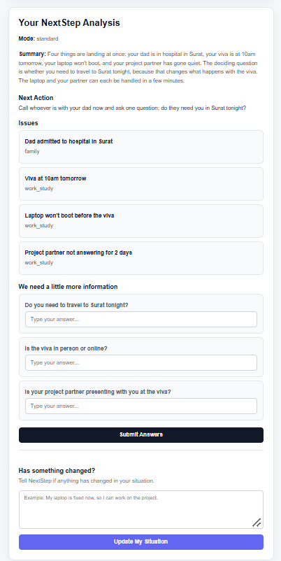

# Scenario 1 — Multi-problem

## Input

Viva is at 10am tomorrow, laptop won't boot, my project partner has been ignoring my calls for 2 days, and my dad just got admitted to a hospital in Surat. I'm in Pune.

## Result

### Mode
standard

### Summary
Four things are landing at once: your dad is in hospital in Surat, your viva is at 10am tomorrow, your laptop won't boot, and your project partner has gone quiet. The deciding question is whether you need to travel to Surat tonight, because that changes what happens with the viva. The laptop and your partner can each be handled in a few minutes.

### Next Action
Call whoever is with your dad now and ask one question: do they need you in Surat tonight?

### Issues

1. Dad admitted to hospital in Surat
   - Category: family

2. Viva at 10am tomorrow
   - Category: work_study

3. Laptop won't boot before the viva
   - Category: work_study

4. Project partner not answering for 2 days
   - Category: work_study

### Clarifying Questions

1. Do you need to travel to Surat tonight?
2. Is the viva in person or online?
3. Is your project partner presenting with you at the viva?

## Screenshot

