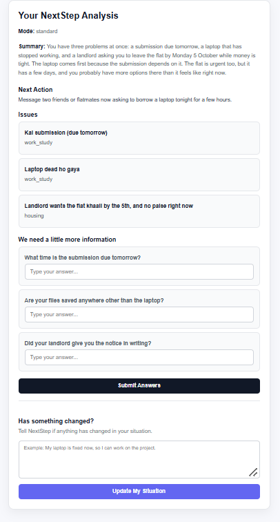

# Scenario 2 — Hinglish

## Input

Kal submission hai, laptop dead ho gaya, aur landlord bol raha hai 5 tareekh tak flat khaali karo. Paise bhi nahi hai abhi.

## Result

### Mode

standard

### Summary

You have three problems at once: a submission due tomorrow, a laptop that has stopped working, and a landlord asking you to leave the flat by Monday 5 October while money is tight. The laptop comes first because the submission depends on it. The flat is urgent too, but it has a few days, and you probably have more options than it feels like right now.

### Next Action

Message two friends or flatmates now asking to borrow a laptop tonight for a few hours.

### Issues

1. Kal submission (due tomorrow)
   - Category: work_study

2. Laptop dead ho gaya
   - Category: work_study

3. Landlord wants the flat khaali by the 5th, and no paise right now
   - Category: housing

### Clarifying Questions

1. What time is the submission due tomorrow?
2. Are your files saved anywhere other than the laptop?
3. Did your landlord give you the notice in writing?

## Screenshot

