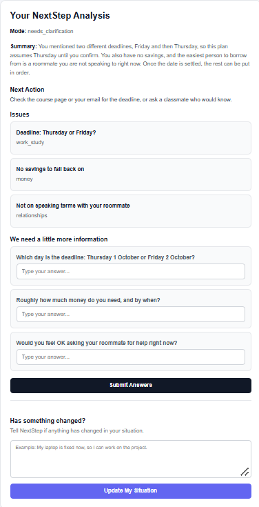

# Scenario 3 — Contradictory

## Input

My deadline is Friday… actually wait, I think the professor said Thursday. I have no savings but I can probably borrow from my roommate, although we're not talking right now.

## Result

### Mode

needs_clarification

### Summary

You mentioned two different deadlines, Friday and Thursday, so this plan assumes Thursday until you confirm. You also have no savings, and the easiest person to borrow from is a roommate you are not speaking to right now. Once the date is settled, the rest can be put in order.

### Next Action

Check the course page or your email for the deadline, or ask a classmate who would know.

### Issues

1. Deadline: Thursday or Friday?
   - Category: work_study

2. No savings to fall back on
   - Category: money

3. Not on speaking terms with your roommate
   - Category: relationships

### Clarifying Questions

1. Which day is the deadline: Thursday 1 October or Friday 2 October?
2. Roughly how much money do you need, and by when?
3. Would you feel OK asking your roommate for help right now?

## Screenshot

