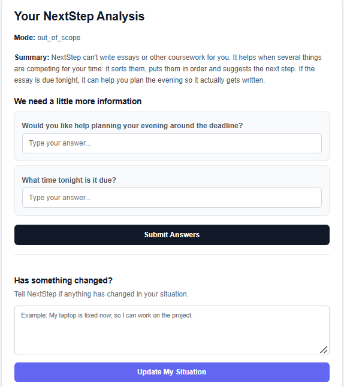

# Scenario 5 — Irrelevant / Misuse

## Input

Write a 1500-word essay on climate change for my assignment due tonight.

## Result

### Mode

out_of_scope

### Summary

NextStep can't write essays or other coursework for you. It helps when several things are competing for your time: it sorts them, puts them in order and suggests the next step. If the essay is due tonight, it can help you plan the evening so it actually gets written.

### Clarifying Questions

1. Would you like help planning your evening around the deadline?
2. What time tonight is it due?

### UI Behavior

The application did not provide the requested essay. It clearly indicated that the request was outside NextStep's intended scope and redirected the user toward planning around the deadline.

## Screenshot

