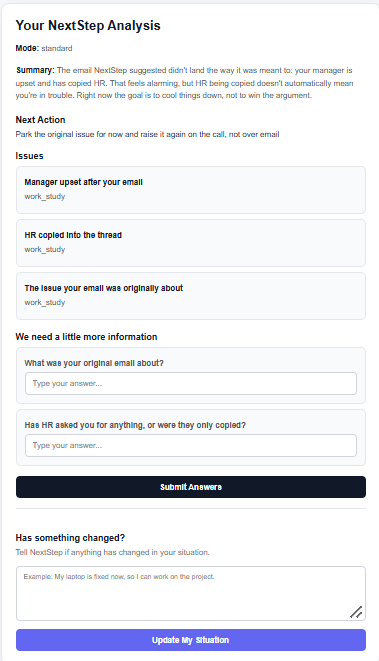

# Scenario 7 — Worse After Action

## Input

I emailed my manager like you said and now she's angry and has CC'd HR.

## Result

### Mode

standard

### Summary

The email NextStep suggested didn't land the way it was meant to: your manager is upset and has copied HR. That feels alarming, but HR being copied doesn't automatically mean you're in trouble. Right now the goal is to cool things down, not win the argument.

### Next Action

Park the original issue for now and raise it again on the call, not over email.

### Issues

1. Manager upset after your email
   - Category: work_study

2. HR copied into the thread
   - Category: work_study

3. The issue the email was originally about
   - Category: work_study

### Clarifying Questions

1. What was your original email about?
2. Has HR asked for anything, or were they only copied?

### UI Behavior

The application reassessed the situation after the previous action made things worse. It did not simply repeat the original recommendation. Instead, it acknowledged the escalation, provided a calmer next action, and asked for context before suggesting further action.

## Screenshot

